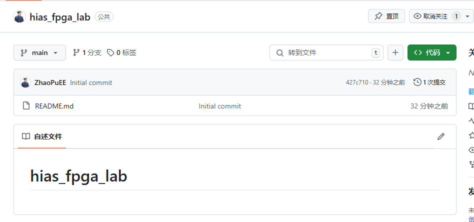

## 第一步：建立github仓库

## 在希望push的文件夹打开git bash

1. git init
2. git add * (或者特定的文件)，添加文件到暂存区
3. git commit -m "first commit" 后为本次提交的描述
4.  打开.git文件夹 在config文件中加入user后面的词条 email name为github的注册邮箱和用户名

5. git remote add origin https://github.com/ZhaoPuEE/hias_fpga_lab.git

   后面填写这个项目的https地址

   

6. git push -u origin master

